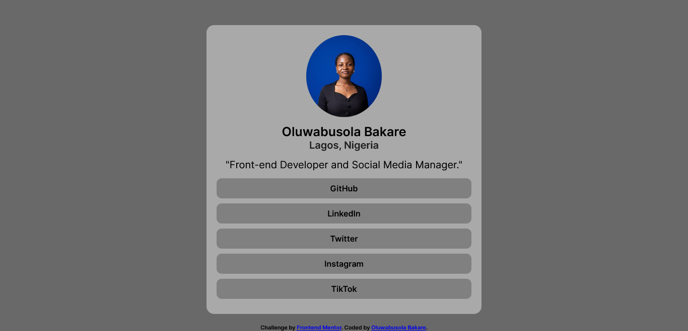

# Frontend Mentor - Social links profile solution

This is a solution to the [Social links profile challenge on Frontend Mentor](https://www.frontendmentor.io/challenges/social-links-profile-UG32l9m6dQ). Frontend Mentor challenges help you improve your coding skills by building realistic projects. 

## Table of contents
  - [Screenshot](#screenshot)
  - [Links](#links)
- [My process](#my-process)
  - [Built with](#built-with)
  - [What I learned](#what-i-learned)
  - [Continued development](#continued-development)
  - [Useful resources](#useful-resources)
- [Author](#author)
- [Acknowledgments](#acknowledgments)

**Note: Delete this note and update the table of contents based on what sections you keep.**

### Screenshot

### Links

- Solution URL: [Add solution URL here](https://github.com/Busola001/Social-Profile.git)
- Live Site URL: [Add live site URL here](https://your-live-site-url.com)

## My process
i wrote the html out from the head to the body and then i styled it and made the site responsive and then after that i used javascript to add the links to my actual social media profiles.

### Built with

- Semantic HTML5 markup
- CSS custom properties
- Mobile-first workflow
- [JavaScript](https://reactjs.org/) - JS library

### What I learned

i practiced how to use set attribute to add links to my html

If you want more help with writing markdown, we'd recommend checking out [The Markdown Guide](https://www.markdownguide.org/) to learn more.

### Continued development

ill continue to learn how to incorporate javascript more for other projects and also the responsive design part, i need to practice more. 
